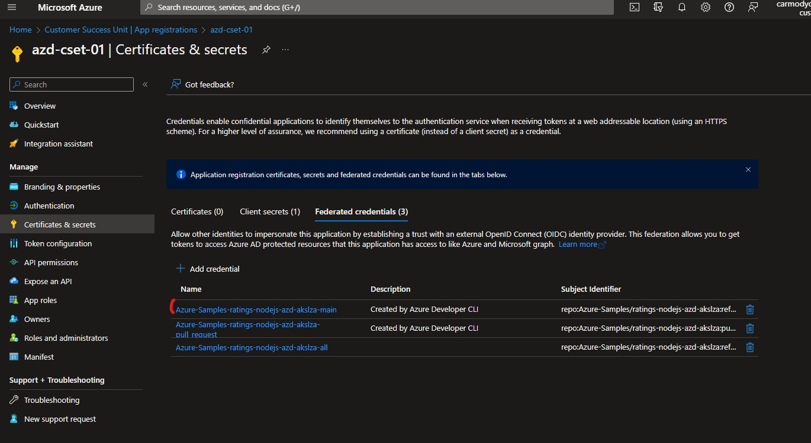

# AKS Landing Zone Accelerator on Azure Developer CLI (AZD)
Accelerate your onboarding to AKS with the Azure develper CLI and AKS landing zone accelerator. Provided here is a blueprint for getting a web app with a Node.js API on Azure using some of the AKS landing zone accelerator best practices. The blueprint includes sample application code (a ratings web app) which can be removed and replaced with your own application code. Add your own source code and use the Infrastructure as Code assets to get running quickly.

# Prerequisites
The following prerequisites are required to use this application. Please ensure that you have them all installed locally when using azd cli.
- [Azure Developer CLI](https://aka.ms/azd-install)
- [Node.js with npm (16.13.1+)](https://nodejs.org/) - for API backend and Web frontend
- [Kubernetes CLI (kubectl)](https://kubernetes.io/docs/tasks/tools/)
- [Docker](https://docs.docker.com/desktop/) - for building application images
- [kubelogin](https://github.com/Azure/kubelogin)
- [jq](https://jqlang.github.io/jq/download/)

This application utilizes the following Azure resources:

- [**AKS Construction**](https://github.com/Azure/AKS-Construction) to deploy an enterprise class secure AKS 
- [**AKS Landing Zone Accelerator**](https://github.com/Azure/AKS-Landing-Zone-Accelerator) for the secure AKS Landing Zone
- [**Ratings Application**](https://github.com/MicrosoftDocs/mslearn-aks-workshop-ratings-api) example application in AKS


| |⚠️ WARNING |
|:----|:---|
| SSL Certificate | Upon navigating to your new FQDN you will see you receive a certificate warning because it is not a production certificate. Using LetsEncrypt staging certificates for your Application Gateway/Ingress Controller is only advised for non-production environments. If you are using Ingress Controllers in your production workloads, we recommend you to purchase a paid TLS certificate. |
| Infrastructure name| Make sure that your name for the infrastructure is lower case  |
| KUBECONFIG | Make sure to remove previous cluster configuration with the same name from your .kube files and unset your KUBECONFIG variable.  During the deployment phase azd will use any KUBECONFIG environment variable and your default ~/.kube/config for both the cluster named in the infrastructure name (aks-${AZURE_INFRA_NAME}) as well as looking for a context of the same name.  If an alternate is set in your environment then the deployment step will attempt to use it.|


# Deploy with azd cli
To deploy with azd cli from a bash environment run the following steps:
Note: Full deployment of the system and applications takes approximately 12 minutes

git clone this repo, cd into the repo directory and then run the following commands
```
unset KUBECONFIG
git submodule init 
git submodule update
azd auth login
azd init
azd up
```

Now wait a few minutes for the ingress and dns to establish and then open up a web browser to the external url provided from the last step

## Deleting Everything
In order to clean up all resources run:
```
azd down
```


# Deploy with github actions
To deploy with github actions run the following steps:
Note: Full deployment of the system and applications can take over 15 minutes

run the following from bash or windows to set up the credentials for github
```
azd pipeline config --principal-name <desired principal name>
```
* Go to [Azure AD App Registrations](https://portal.azure.com/#view/Microsoft_AAD_IAM/ActiveDirectoryMenuBlade/~/RegisteredApps) and search for the principal name you used in the last step.  Make sure to turn off any filters in order to find it.
* Select the App Registration 
* Select the Certificates & secrets blade
* Select the Federated credentials tab

* Copy the credentials for the main branch for your branch name

* Go to the github Actions variables and make sure you provide the following variables:
    * AZURE_DNS_LABEL - the short label to use for dns which will be ${AZURE_DNS_LABEL}.${AZURE_LOCATION}.cloudapp.azure.com
    * AZURE_EMAIL_ADDRESS - a valid email address must be provided for the staging certificate from LetsEncrypt
    * AZURE_ENV_NAME - an enviroment name (such as dev, test, prod) for this deployment
    * AZURE_INFRA_NAME - a name seed for the infrastructure, which will result in names such as ${AZURE_INFRA_NAME}-rg or aks-${AZURE_INFRA_NAME}
    * AZURE_LOCATION - the azure location for deployment such as eastus or centralus

Also ensure that the AZURE_CLIENT_ID, AZURE_SUBSCRIPTION_ID and AZURE_TENANT_ID has been set by the "azd pipeline config" step.


